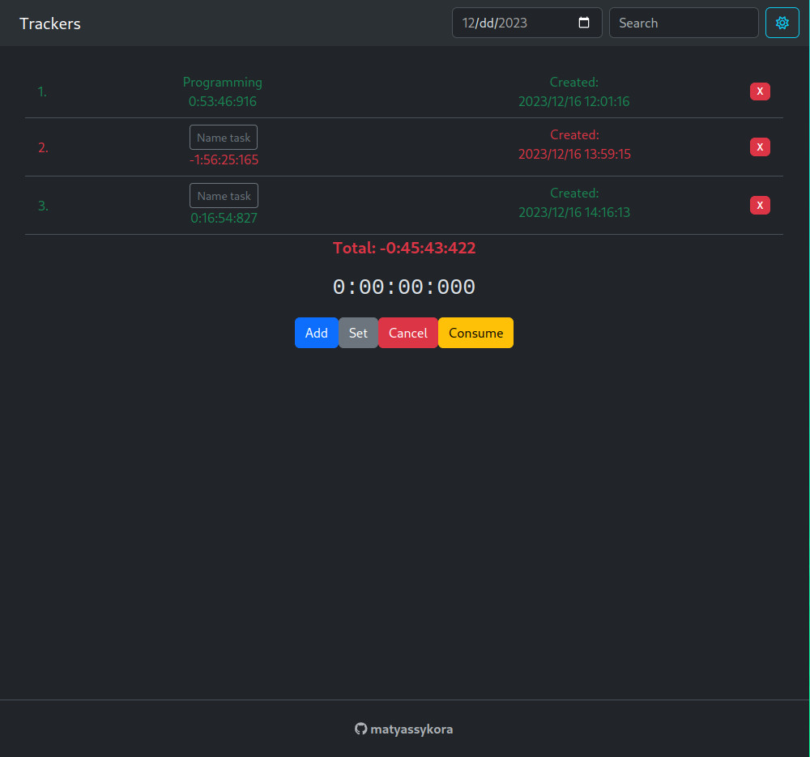

# Time tracker
Is a tool for tracking the time you spend procrastinating vs being productive


## Dependencies
### [Python 3](https://www.python.org/downloads/)
### [pip](https://pip.pypa.io/en/stable/installation/)
### [pipenv](https://pipenv.pypa.io/en/latest/)
```sh
pip install --user pipenv
```
### [npm](https://www.npmjs.com/package/npm)
```sh
curl -qL https://www.npmjs.com/install.sh | sh
```

## Running the App
Go to the _backend_ directory and:
```sh
pipenv install
```
```sh
pipenv shell
```
```sh
python manage.py migrate
```
```sh
python manage.py runserver
```
